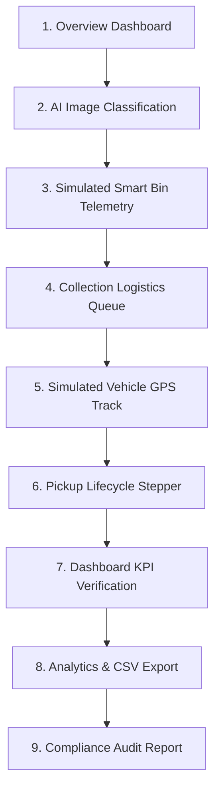

# SmartWaste 360 — Live Demonstration & Verification Walkthrough

This guide details the step-by-step procedure to execute a complete **5–7 minute live project demonstration** showing end-to-end integration across AI categorization, IoT smart bins, collection logistics, fleet tracking, analytics, and operational compliance.

---

## Demo Flow Overview

---

## Step-by-Step Demonstration

### Step 1: Open Operations Dashboard
1. Navigate to `http://localhost:5173/overview`.
2. **Key Points to Present**:
   - Highlight the **System Status Panel** at the top showing live connections: Backend Engine, SQLite3 Database Link, AI Model (`waste_model.h5`), and the active status of the IoT Simulation.
   - Point out the **8 Core KPI Cards**: Total Waste, BIO Waste, NON-BIO Waste, Segregation Rate, Active Pickups, Available Vehicles, Bins Near Full, and Critical Alerts.
   - Show that **no hard-coded numbers** are used; the dashboard updates dynamically via 3-second API polling from the backend.

### Step 2: Open Waste AI (Camera Classification)
1. Go to **Waste AI** page.
2. Click **Open Camera**. If prompted, grant camera permissions (or use the simulated fallback camera placeholder).
3. Click **Capture Photo** -> review the freeze frame -> click **Classify**.
4. **Key Points to Present**:
   - The MobileNetV2 classification engine classifies the waste in real-time.
   - Demonstrates category outcome (**BIODEGRADABLE** / **NON-BIODEGRADABLE**) with confidence % and classification status.
   - Check the **Classification History** at the bottom; verify the newly captured record has been logged in the database.

### Step 3: Open Smart Bins & Telemetry Simulator
1. Navigate to **Smart Bins**.
2. Identify a bin (e.g., `BIN-003 Canteen Left`) and toggle **Start Simulation**.
3. **Key Points to Present**:
   - Show the fill level %, distance in cm, and timestamp updating in real-time.
   - Explain the physical prototype contract: the UI displays the `SIMULATED SENSOR DATA` badge because physical hardware is not connected.
   - Wait for the bin to cross the **80% (Almost Full)** or **95% (Critical)** threshold.
   - Point out that a system alert is dynamically generated in the database and the notification bell badge in the header instantly increments.

### Step 4: Open Collections (Scheduling)
1. Go to the **Collections** page.
2. Click **Create Pickup** or schedule a pickup for the full bin.
3. Fill out the form: select the establishment, waste category, and estimated quantity (kg).
4. Click **Create**.
5. Select the scheduled pickup from the list and **Assign Vehicle** / **Assign Driver**.

### Step 5: Open Vehicles (Simulated Tracking)
1. Go to the **Vehicles** page.
2. Locate the assigned vehicle.
3. **Key Points to Present**:
   - Point out the `SIMULATED VEHICLE LOCATION` badge.
   - Explain that the vehicle tracks smoothly along Pune campus waypoints rather than jumping randomly.
   - Observe the live load progress, capacity utilization %, and status updates.

### Step 6: Open Pickups (Operations Monitoring)
1. Navigate to **Pickups** (Pickup Monitoring).
2. Select your active pickup job.
3. Move the pickup through the operational lifecycle stepper:
   `SCHEDULED` -> `ASSIGNED` -> `IN_TRANSIT` -> `ARRIVED` -> `COLLECTED` -> `COMPLETED`.
4. Click **Complete Pickup** on the final step.

### Step 7: Verify Dashboard Updates
1. Return to the **Dashboard** (`http://localhost:5173/overview`).
2. Verify that **Total Waste** has increased and active/completed pickup counts have updated to reflect the completed job.

### Step 8: View Analytics
1. Navigate to the **Analytics** page.
2. Check the real-time aggregations: Waste generation trend, BIO vs NON-BIO distribution, and vehicle utilization charts.
3. Click **Export CSV** to download the raw data report generated directly from database tables.

### Step 9: View Operational Compliance
1. Go to the **Compliance** page.
2. Point out the **Overall Compliance Score** (0–100%) and compliance status.
3. Explain the **Root Cause Failure Reasons** section, which automatically details why scores dropped (e.g., "Segregation rate decreased because...").
4. Click **Export Compliance Report** to download the official audit report.
