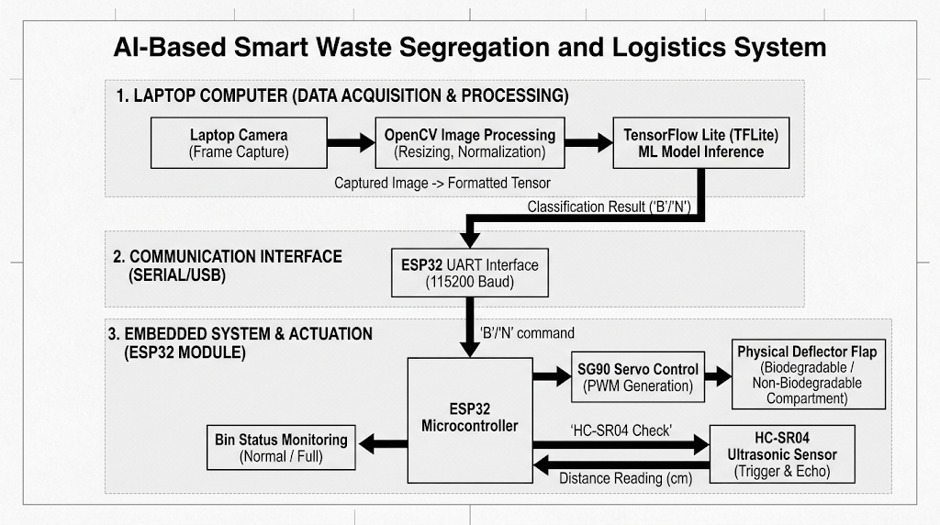
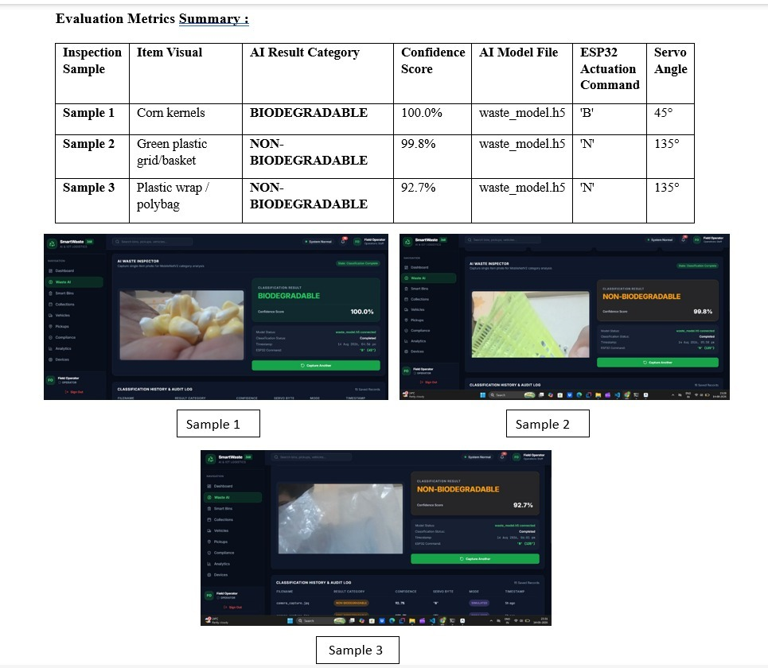

# SmartWaste 360 — AI-Powered Waste Segregation & IoT Logistics Management System

SmartWaste 360 is a commercial-grade, professional waste-management SaaS platform designed to automate waste categorization at the source and optimize central collection logistics. Combining a **TensorFlow Deep Learning model**, **simulated & physical ESP32 IoT telemetry nodes**, **GPS vehicle route tracking**, and **operational compliance audit systems**, SmartWaste 360 delivers an end-to-end sustainable waste management ecosystem.

---

## 🔗 Quick Links & Live Demos

- **🖥️ GitHub Repository**: [https://github.com/Aniket8983-arch/ChaiToast](https://github.com/Aniket8983-arch/ChaiToast)
- **📺 Video Demonstration**: [Watch SmartWaste 360 System Demo on YouTube](https://youtu.be/h0qdp-59xE0?si=aAVTMuuholssLX5Q)
- **🧠 Trained AI Model Download**: [Download waste_model.h5 on Google Drive](https://drive.google.com/file/d/1iK7jvSfYGHCvXhUvm1KGsVtuS3Wo4Z-w/view?usp=sharing)
- **💻 Local Dashboard Server**: `http://localhost:5173/` *(Follow local installation steps below)*

> [!NOTE]
> **Trained AI Model Storage Notice**: Due to file size limitations on remote repositories, the trained model (`waste_model.h5`) is hosted externally. Please download it from the Google Drive link above and place it in the project directory at `models/waste_model.h5`.

---

## 🌍 Problem Statement
In traditional waste management systems, manual segregation is prone to human error, increases operational costs, and leads to severe cross-contamination of recyclable materials. Furthermore, municipal and commercial collection fleets operate on fixed schedules rather than dynamic demand, leading to inefficient vehicle routes, high carbon emissions, and overfilled public bins.

## 🚀 The Solution
SmartWaste 360 provides a complete automated ecosystem:
1. **At-Source AI Segregation**: Computer vision identifies waste category instantly, triggering physical sorting flaps via microcontrollers.
2. **On-Demand Telemetry**: Smart bins compute fill levels in real time and automatically trigger collection requests when threshold levels (80%) are exceeded.
3. **Optimized Route Logistics**: Dispatchers schedule pickups, assign vehicles, and monitor fleet locations along live GPS waypoints.
4. **Operations Dashboard**: Provides real-time metrics across waste totals, segregation rates, critical alerts, and operational compliance.

---

## 🏗 System Architecture & Hardware Integration



### Architecture Layer Breakdown

1. **Data Acquisition & AI Processing (Computer / Server)**:
   - **Camera Frame Capture**: Captures real-time camera snapshot of the item placed in the visual targeting frame.
   - **OpenCV Image Preprocessing**: Converts image format to 3-channel RGB, crops the central region, and resizes to `224x224` pixels.
   - **TensorFlow Keras Model**: Runs inference through `waste_model.h5` (MobileNetV2 deep learning architecture).
   - **Classification Result**: Outputs category decision `'B'` (Biodegradable) or `'N'` (Non-Biodegradable) with confidence metrics.

2. **Communication Interface (Serial / USB / WiFi)**:
   - **ESP32 UART Interface**: Passes structured byte commands over 115200 Baud USB TTL serial or HTTP REST API.

3. **Embedded System & Physical Actuation (ESP32 Microcontroller Module)**:
   - **SG90 Servo Control**: Generates PWM signals to actuate a physical deflector flap:
     - **Biodegradable (`'B'`)**: Servo rotates to **45°** for 3 seconds.
     - **Non-Biodegradable (`'N'`)**: Servo rotates to **135°** for 3 seconds.
     - **Rest Position**: Flap returns to **90°** standby position.
   - **HC-SR04 Ultrasonic Sensor**: Measures real-time bin fill distance (cm) and computes fill percentage:
     $$\text{Fill Percentage (\%)} = \left( \frac{\text{Bin Height (cm)} - \text{Sensor Distance (cm)}}{\text{Bin Height (cm)}} \right) \times 100$$

---

## 📊 AI Evaluation Metrics & Live Inspection Samples

SmartWaste 360 has been evaluated across real-world waste items to verify classification accuracy and microcontroller actuation response.



### Classification Performance Matrix

| Inspection Sample | Item Visual Description | AI Result Category | Confidence Score | AI Model File | ESP32 Actuation Command | Servo Angle |
| :--- | :--- | :--- | :--- | :--- | :--- | :--- |
| **Sample 1** | Corn kernels | **BIODEGRADABLE** | **100.0%** | `waste_model.h5` | `'B'` | 45° |
| **Sample 2** | Green plastic grid / basket | **NON-BIODEGRADABLE** | **99.8%** | `waste_model.h5` | `'N'` | 135° |
| **Sample 3** | Plastic wrap / polybag | **NON-BIODEGRADABLE** | **92.7%** | `waste_model.h5` | `'N'` | 135° |

---

## 📦 Key Platform Modules

- **AI Waste Inspector**: Interactive camera preview with dashed visual target overlay and MobileNetV2 classification engine.
- **Smart Bin Telemetry**: Real-time ultrasonic sensor monitoring with customizable warning (80%) and critical (95%) alert thresholds.
- **Collections & Logistics**: Pickup request scheduler, vehicle assignment desk, and status lifecycle tracker (*Scheduled* → *In Transit* → *Completed*).
- **Simulated Vehicle Tracking**: Real-time fleet location mapping along simulated routes in Pune.
- **System Compliance & Audit**: Automated root-cause detection for delayed pickups or offline telemetry devices.
- **Analytics & Reporting**: Historic category distribution, waste generation trends, and CSV data export capabilities.

---

## ⚙ Technology Stack

- **Frontend**: React 18, TypeScript, TailwindCSS, TanStack Query, Lucide Icons, Chart.js.
- **Backend**: FastAPI, SQLAlchemy ORM, Uvicorn, Python Multipart, SQLite.
- **AI / ML**: TensorFlow 2.x, Keras, MobileNetV2 Transfer Learning, PIL, NumPy.
- **Embedded / Hardware**: ESP32 Microcontroller, SG90 Micro Servo, HC-SR04 Ultrasonic Sensor, C++ / Arduino Framework.

---

## 🛠 Installation & Local Setup

### 1. Prerequisites
- **Python**: Version `3.10` or `3.11`
- **Node.js**: Version `18+` and `npm`

### 2. Environment Setup
Create a `.env` file in the `backend/` directory:
```ini
APP_NAME="SmartWaste 360"
DATABASE_URL="sqlite:///./data/smartwaste.db"
SIMULATION_ENABLED=True
SECRET_KEY="your-secret-key-here"
```

### 3. AI Model File Setup
Download `waste_model.h5` from [Google Drive](https://drive.google.com/file/d/1iK7jvSfYGHCvXhUvm1KGsVtuS3Wo4Z-w/view?usp=sharing) and place it at:
```text
models/waste_model.h5
```

### 4. Backend Setup
```bash
cd backend
pip install -r requirements.txt
python main.py
```
*The FastAPI backend will launch on `http://localhost:8000` and automatically initialize the SQLite database with seed records.*

### 5. Frontend Setup
```bash
cd frontend
npm install
npm run dev
```
*The React application will launch on `http://localhost:5173`.*

---

## 🔑 Default Credentials
- **ADMIN Role**: username `admin` / password `admin123`
- **OPERATOR Role**: username `operator` / password `operator123`

---

## 📁 Repository Structure

```
ChaiToast/
├── backend/
│   ├── app/
│   │   ├── api/routes/          # Auth, Bins, Vehicles, Waste, Compliance, Analytics
│   │   ├── models/              # SQLAlchemy Database Models
│   │   ├── schemas/             # Pydantic Request/Response Schemas
│   │   ├── services/            # Seed & Data Initialization Services
│   │   └── main.py              # FastAPI Application Lifecycle
│   ├── scratch/                 # Model verification & Diagnostic scripts
│   ├── requirements.txt
│   └── main.py                  # Server Launcher
├── docs/                        # Architecture & Demonstration Guides
├── frontend/
│   ├── src/
│   │   ├── components/          # UI Component Library & Layouts
│   │   ├── pages/               # Dashboard, AI Classifier, Bins, Vehicles, Pickups
│   │   ├── context/             # AuthContext Session State
│   │   └── lib/                 # Axios Client & Utilities
│   └── package.json
├── hardware/                    # ESP32 Arduino Sketches & Circuit Specs
├── images/                      # System Architecture & Metric Diagrams
├── models/
│   └── waste_model.h5           # Trained MobileNetV2 Deep Learning Model
├── simulation/                  # Sensor & Vehicle Location Simulators
├── readme.md                    # System Documentation
└── test_model_image.py          # Standalone Image Inference Tester
```

---

## 📜 License & Citation
SmartWaste 360 is open-source software built for sustainable waste management research and logistics automation.
